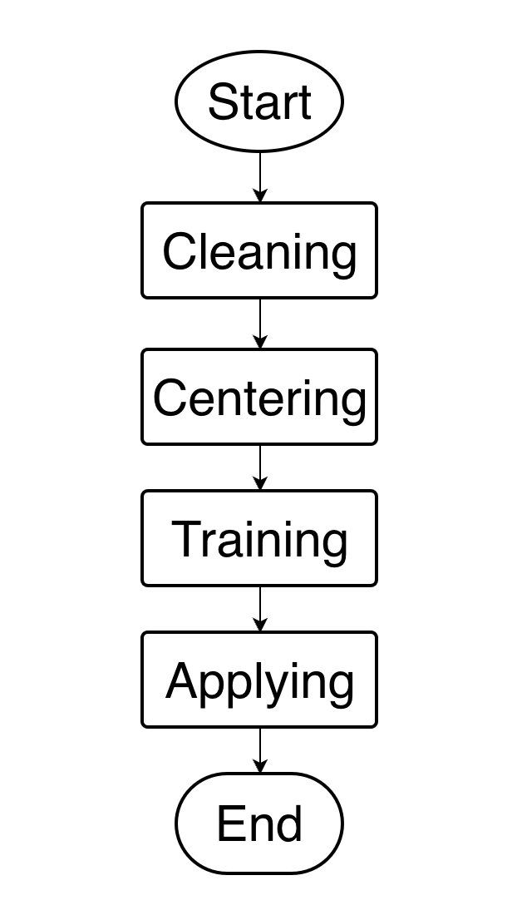
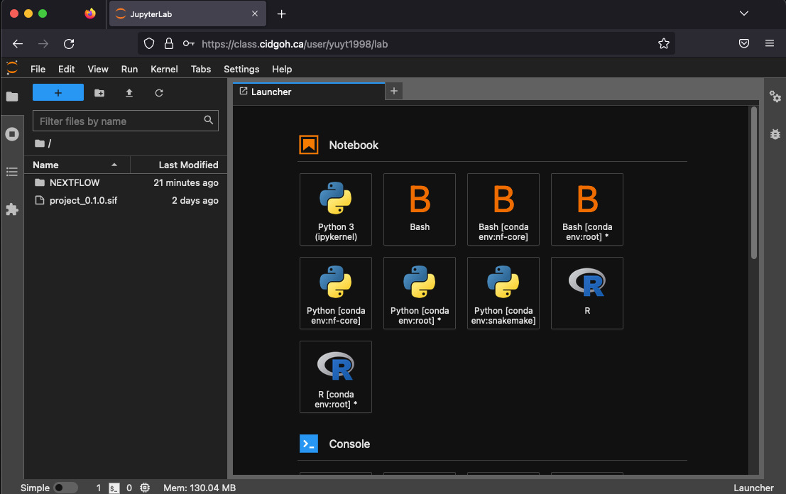

# 2022W1 BIOF501A Term Project -- Jordan Yu

# I. Backgroud

## I.1 Introduction

This project is based on CentileBrain project. CentileBrain provides the opportunity to generate metrics for typical brain trajectories for research purposes only based on models provided by the ENIGMA Lifespan Working Group. CentileBrain offers its [online computation platform](https://centilebrain.org/#/model) in which users can make predictions for subcortical volume, cortical thickness and surface area based on multivariate fractional polynomial regression[1] models derived from over 40,000 healthy subjects across the world.

## I.2 Purpose

Sometimes users may want to use their own data to generate models and get predictions but without any clue how to run complicated R scripts. This project is to help users in such case to simply input their training data and unseen data then get predictions from their own models. This workflow project is based on nextflow and it integrates essential R scripts to its workflow, so that users need not to worry about running any R scripts during this workflow. They only need to formulate their training data and unseen data based on provided template. The sample training data is included in GitHub repository. The sample data is from the Department of Psychiatry, University of British Columbia. Since the dataset is private, only part of it is used for demo purposes in this project.

The following is the DAG diagram for this workflow.

# II. Usage

## II.1 Input and Output

In this workflow, there are 2 inputs and we expect 1 output file containing prediction values for all morphometric features eventually.

### II.1.1 Input:

-   `data/rawdata.csv`

    This file has 17 columns and 50 subjects (rows). See details of data fields from the table below.

    | Data field                                                                            | Description                                                             |
    |---------------------------------------|---------------------------------|
    | SITE                                                                                  | the place in which data acquired                                        |
    | age                                                                                   | the age of subject                                                      |
    | TIV                                                                                   | total intracranial volume                                               |
    | Lthal,Rthal,Lcaud,Rcaud,Lput,Rput,Lpal,Rpal,Lhippo,Rhippo,Lamyg,Ramyg,Laccumb,Raccumb | names of 14 morphometric features for subcortical volume of human brain |

    The data are numerical values from T1-weighted MRI images. All data in this file are from the Department of Psychiatry, University of British Columbia.

-   `data/unseenData.csv`

    This file has 17 columns and 50 subjects (rows). However, there is no data for 14 morphometric features of subcortical volume but only having values for the first 3 fields, i.e. SITE, age and TIV. This file is used for getting predictions for 14 morphometric features based on the models trained from `data/rawdata.csv` file. This file has the same data fields as `data/rawdata.csv`.

### II.1.2 Output

The expected output file from this workflow is a csv file containing all predicted values for 14 morphometric features of subcortical volume. It should have the same number of rows as `data/unseenData.csv` and 14 columns with the same name of all morphometric features of subcortical volume.

## II.2 Processes

There are 4 processes in this workflow:

1.  Cleaning

    The first process is data cleaning, including removing all subjects with Null values, removing outliers. The input of this process is the "rawdata.csv" in \`data/\` folder. Details regarding rawdata will be discussed in Usage section. The output of this process is "processed_data.csv" in which contains all data after data cleaning.

2.  Centering

    The second process is data centering. This is to decrease the discretion of all data by subtracting the mean value of each morphometric feature. The input of this process is processed data, i.e. the data after cleaning which is the output of process 1. The output of this process is "data_training_centered.csv".

3.  Training

    The third process is model training. It uses the training data to generate its own multivariate fractional polynomial model. The input of this process is "data_training_centered.csv" from process 3. The output of this process is "mfpModel_subcorticalvolume_list.rds".

4.  Applying

    The forth and also the last process is applying unseen data to trained models then get predicted results. The input of this process has two components: (1) "unseenData.csv" from `data/` folder (2) "mfpModel_subcorticalvolume_list.rds" from process 3.

## II.3 Environment

This workflow is required to be run under specific environment. We choose singularity and created a container for this project for reproducibility and robustness. The container can be downloaded at [library://yuyt98/biof501a/project:0.1.0](library://yuyt98/biof501a/project:0.1.0). For convenience, the environment has been added to the workspace, i.e. `/project_0.1.0.sif`. Specifically, this environment requires the following dependencies:

-   R-base 4.1.2

-   mfp 1.5.2.2

-   writexl 1.4.1

-   tidyverse 1.3.2

## II.4 Actions

Here we demonstrate how to run this workflow on the server provided by BIOF501A class. So we assume that both nextflow and singularity are installed. Please go to the provided [workspace](https://class.cidgoh.ca/user/yuyt1998/lab) for further actions. 

After login, you will see the following page:

Now you are on the correct way to success! Run steps below to get workflow started:

-   Start a new terminal window from the Launcher in JupyterLab, run the following command to enter the `NEXTFLOW` folder:

    `cd NEXTFLOW`

-   Run the workflow:

    `./main.nf -w work`

After running the workflow, you can find the output file in this path: `NEXTFLOW/output/predictions.csv`.

# III. Reference

1.  Royston, Patrick & Altman, Douglas. (1995). Using fractional polynomials to model curved regression relationships. Stata Technical Bulletin. 4.
